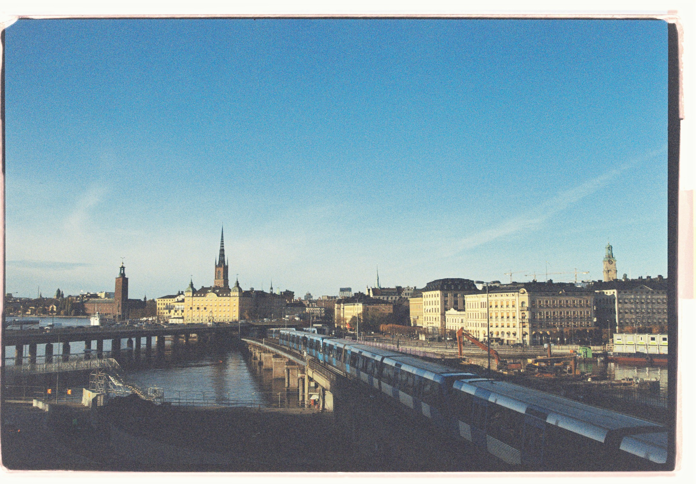

### by [Dominik Freunberger](https://dmnkfr.netlify.app/)




A [friend](https://www.andifugard.info/) recently published [a very nice analysis](https://inductivestep.github.io/Google-transit-London/) of how Londoners changed their mobility behavior during the COVID-19 pandemic as compared to before the pandemic. I wondered how this looks for the Stockholm region in Sweden, so I replicated Andy's analysis for this area.

```{r setup, message = F}
library(tidyverse)
library(magrittr)
library(lubridate)
library(readxl)
library(ggrepel)
library(ggpubr)
library(hrbrthemes)
```
The data is from [Google](https://www.google.com/covid19/mobility/), so, to quote [Andi](https://inductivestep.github.io/Google-transit-London/), "data quality unclear..."

``` {r get-data, eval=FALSE}
if(!file.exists("movement_data")) {
        dir.create("movement_data")
}
dataURL = "https://www.gstatic.com/covid19/mobility/Region_Mobility_Report_CSVs.zip"
download.file(dataURL, destfile="./movement_data/movement.zip", method = "curl")
unzip("./movement_data/movement.zip", exdir = "./movement_data")
```

``` {r tidy-data, message=FALSE}
data = read.csv("./movement_data/2020_SE_Region_Mobility_Report.csv")

data %<>% mutate(
        day = parse_date(date, "%Y-%m-%d"),
        day_of_week = wday(day, label = TRUE),
        weekday = ifelse(day_of_week %in% c("Sat", "Sun"), "Weekend", "Weekday"))

sthlm_data = data %>%
        filter(sub_region_1 == "Stockholm County" & sub_region_2 != "") %>%
        select(date,
               day,
               weekday,
               sub_region_2,
               ends_with("percent_change_from_baseline"))

tidy_sthlm = sthlm_data %>%
        pivot_longer(
          cols = ends_with("percent_change_from_baseline"),
          names_to = "location",
          names_pattern = "(.+)_percent_change_from_baseline",
          values_to = "percent_change_from_baseline") %>% 
        mutate(sub_region_2 = word(sub_region_2, 1))

tidy_sthlm %>%
        select(location, percent_change_from_baseline) %>%
        filter(!is.na(percent_change_from_baseline)) %>%
        group_by(location) %>%
        summarise(mean_change = mean(percent_change_from_baseline, na.rm = T),
	          count = sum(!is.na(percent_change_from_baseline)),
	          NAs = sum(is.na(percent_change_from_baseline)))
```
As you can see, there's more data included but here we'll focus on the data about mobility trends for places of work. Let's grab that data and plot it.

### How did mobility change in the different municipalities?

```{r prepare-plot1, warning=FALSE, message=FALSE}
tidy_work = tidy_sthlm %>%
  filter(location %in% c("workplaces"))

plot1 = tidy_work %>%
        mutate(location = gsub("_", " ", location)) %>%
        ggplot(aes(x = day, 
                   y = percent_change_from_baseline,
                   color = sub_region_2)) +
        theme(legend.position = "none") +
        labs(x = "Date", y = "% Change from Baseline") +
        theme_ipsum()

```

```{r plot1, fig.dim=c(12,6), warning=FALSE, message=FALSE}
plot1 +
  geom_smooth(se = F, size = 1) +
        scale_color_discrete(name = "Municipality")
```
While we can see that some regions went back to business-as-usual, other areas reduced their mobility to a very large degree and kept it that way throughout 2020.

### Which areas have more people who still have to travel to their workplaces?

```{r plot2, fig.dim=c(8,6), warning=FALSE, message=FALSE}
tidy_sthlm %>%
        filter(location %in% c("workplaces")) %>%
        filter(day >= as.Date("2021-01-01") &
                       day < as.Date("2021-03-01")) %>%
        group_by(sub_region_2) %>%
        summarise(mean_change = mean(percent_change_from_baseline)) %>%
        na.omit() %>%
        mutate(sub_region_2 = fct_reorder(sub_region_2, mean_change)) %>%
        ggplot(aes(y = sub_region_2, x = mean_change)) +
        geom_point(size = 3, col = "#e02c24") +
        labs(y = "Municipality", 
             x = "% Change from baseline", 
             title = "Visits to workplaces",
             subtitle = "Mean change from pre-COVID baseline, Jan to Feb 2021") +
        theme_ipsum()
```

__Interesting.__   
You don't have to live in Stockholm for long to see that this order is not random. Rather, it seems to have to do with how posh, or, how wealthy a municipality is. Let's see if there's something to it.
I'll get the Swedish income data from [SCB](https://www.scb.se/hitta-statistik/statistik-efter-amne/hushallens-ekonomi/inkomster-och-inkomstfordelning/inkomster-och-skatter/pong/tabell-och-diagram/inkomster--individer-lankommun/sammanraknad-forvarvsinkomst-2019--per-kommun-efter-percentiler/).

### Is there a relationship between income and workplace visits during COVID-19?
Let's plot the percentage change in workplace mobility as a function of the municipalities' income.

``` {r get-income-data, warning=FALSE, message=FALSE}
if(!file.exists("income_data")) {
        dir.create("income_data")
}
# I downloaded the data here:
# https://www.scb.se/hitta-statistik/statistik-efter-amne/hushallens-ekonomi/inkomster-och-inkomstfordelning/inkomster-och-skatter/

sthlm_income = read_excel("./income_data/income.xls", skip = 3) %>% 
        select(1,2,4) %>% 
        rename(municipality = ...1, 
               mean_income = `Kvinnor och män`,
               median_income = ...4) %>%
        filter(municipality %in% tidy_sthlm$sub_region_2)

sthlm_work = tidy_sthlm %>%
        filter(location %in% c("workplaces")) %>%
        filter(day >= as.Date("2021-01-01") & day < as.Date("2021-03-01")) %>%
        group_by(sub_region_2) %>%
        summarise(mean_change = mean(percent_change_from_baseline)) %>%
        na.omit() %>% 
        rename(municipality = sub_region_2) %>%
        inner_join(sthlm_income, by = "municipality") %>% 
        mutate(mean_income = round(as.numeric(mean_income), 2),
               median_income = round(as.numeric(median_income), 2))
```

```{r plot3, fig.dim=c(8,6), warning=FALSE, message=FALSE}
ggplot(sthlm_work, aes(y = mean_change, x = median_income)) +
  stat_smooth(method = "lm", col = "#e02c24", se = FALSE, size = 1) +
        geom_point(shape = 1, size = 3, alpha = .5) +
        labs(title = "Workplace Mobility: A Matter of Wealth?",
             y = "% Mobility Change from Baseline",
             x = "Median Income of Municipality in SEK (2019)") +
        scale_y_reverse()+
                ggrepel::geom_text_repel(aes(label = municipality), size = 4) +
        stat_cor(method="pearson", label.y = 38.5, label.x = 275000, size = 5) +
        theme_ipsum()

```

There's a surprisingly __strong relationship between wealth and mobility change during COVID-19__. So, one could speculate that people in lower income areas care less about restrictions in general and travel more anyway. Since the data provided by Google includes also info about mobility in other domains, such as retail and recreation, or pharmacy and grocery shopping, we can explore this assumption.

<br/>

### How did mobility change in private domains?

Here we'll plot mobility change in __retail and recreation__ as well as __pharmacy and grocery shopping__ as a function of the municipalities' income.

```{r plot4, fig.dim=c(10,5), warning=FALSE, message=FALSE}
tidy_sthlm %>%
        filter(location %in% c("retail_and_recreation", "grocery_and_pharmacy")) %>%
        filter(day >= as.Date("2021-01-01") & day < as.Date("2021-03-01")) %>%
        group_by(sub_region_2, location) %>%
        summarise(mean_change = mean(percent_change_from_baseline)) %>%
        na.omit() %>%
        rename(municipality = sub_region_2) %>%
        inner_join(sthlm_income, by = "municipality") %>% 
        mutate(mean_income = round(as.numeric(mean_income), 2),
               median_income = round(as.numeric(median_income), 2)) %>% 
        ggplot(aes(y = mean_change, x = median_income)) +
                geom_point(shape = 1, size = 3,alpha = .5) +
                stat_smooth(method = "lm",  col = "#e02c24", se = FALSE, size = 1) +
                scale_y_reverse() +
                labs(title = "Private Mobility: A Matter of Wealth?",
                     y = "% Mobility Change from Baseline",
                     x = "Median Income of Municipality in SEK (2019)") +
                ggrepel::geom_text_repel(aes(label = municipality), size = 3) +
        stat_cor(method="pearson", label.y = 43, label.x = 280000, size = 4) +
        theme_ipsum() +
        facet_grid(. ~ location, scales = "free", labeller = label_parsed)


```

From these plots it becomes clear that there is __no relationship between private commutes and a municipality's wealth__, showing that __people from lower income areas do not travel more in general but rather do not have the option to work from home as easily as people from higher income areas__.

<br/>

A possible confound here is distance to the city centre. More people live in the suburbs but workplaces tend to accumulate in the centre, forcing more people to travel even when the proportions across municipalities are the same. So let's add distance to city centre to the plot from above.

```{r plot5, fig.dim=c(10,6), warning=FALSE, message=FALSE}
# Distance to Stockholm calculated from https://sv.distance.to/
sthlm_dist = data.frame(
        "distance_from_centre" = c(20.4, 18.41, 11.63, 19.28, 5.94, 6.76, 68.95, 
                                   40.43, 43.10, 21.40, 34.84, 30.10, 14.47, 
                                   4.87, 0, 6.54, 11.63, 15.93, 25.03, 36.33),
        municipality = sthlm_work$municipality) %>%
        cbind(sthlm_work) %>% 
        select(-3)

sthlm_work %>% 
        left_join(sthlm_dist) %>% 
        ggplot(aes(y = mean_change, x = median_income)) +
        stat_smooth(method = "lm", col = "grey", se = FALSE, size = 1) +
        geom_point(aes(color = distance_from_centre), size = 3) +
        labs(title = "Workplace Mobility: A Matter of Wealth?",
             y = "% Mobility Change from Baseline",
             x = "Median Income of Municipality in SEK (2019)") +
        scale_y_reverse()+
         scale_color_gradient(name = "Distance to Stockholm city in km", low = "blue", high = "red") + 

                ggrepel::geom_text_repel(aes(label = municipality), size = 4) +
        theme_ipsum()

```

As we can see, municipalities further away from the centre ___tend___ to travel more during the pandemic but there's plenty of striking exceptions (such as Nykvarn or Haninge), clearly indicating that it is __the income of an area that governs whether people have the ability to work from home or not__.

This is of course not surprising. Plenty of analyses have shown that lower income (but also other factors, such as being male, less educated, not married, an immigrant, etc.) increases the risk of [death through COVID-19](https://www.nature.com/articles/s41467-020-18926-3). The need to travel to work is often accompanied by the need to use public transport, thereby increasing the risk of being exposed to the virus.

Note that this little analysis is neither meant to be comprehensive nor complete. Rather, I was surprised by by the initial pattern that emerged and then I wondered and then I explored. Please don't hesitate to [contact me](https://dmnkfr.netlify.app/) for any questions, comments, or feedback.

<br/>
